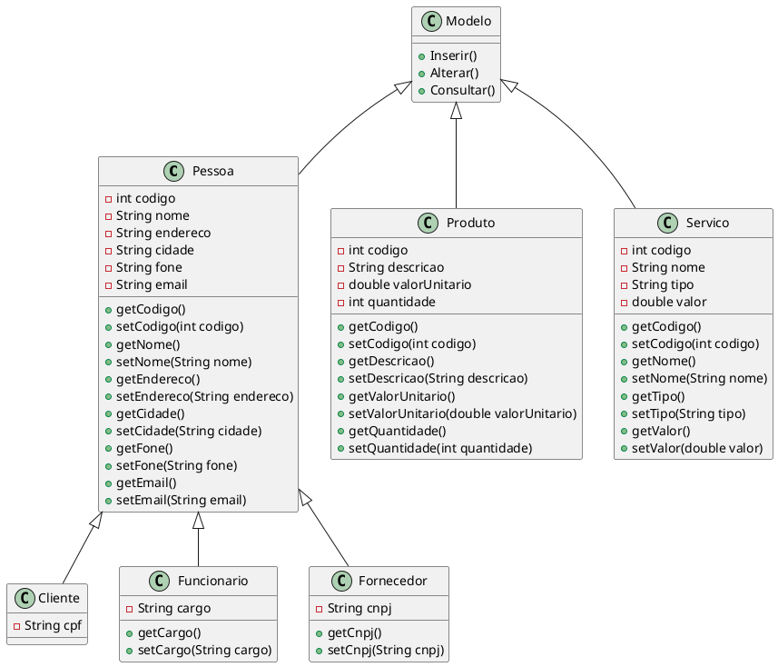

# Exercício de classes

## 1. Uma Farmácia necessita informatizar seus processos

Considerar o seguinte cenário para esta empresa:

- a) Classe cliente
  - Atributos: Código, Nome, Endereço, Cidade, Fone, E-mail e CPF
  - Operações: Incluir, Alterar e Consultar;
- b) Classe funcionário
  - Atributos: Código, Nome, Endereço, Cidade, Fone, E-mail e Cargo
  - Operações: Incluir, Alterar e Consultar;
- c) Classe fornecedor
  - Atributos: Código, Nome, Endereço, Cidade, Fone, E-mail e CNPJ
  - Operações: Incluir, Alterar e Consultar;
- d) Classe produto
  - Atributos: Código, Descrição, Valor unitário e Quantidade
  - Operações: Incluir, Alterar e Consultar;
- e) Classe serviço
  - Atributos: Código, Nome, Tipo, Valor
  - Operações: Incluir, Alterar e Consultar;

> Criar as classes de forma aproveitar os dados aplicando generalização e especialização
(herança).

## Resolução

Abaixo irei postar a resolução em `plantuml` uma ferramenta para facilitar a criação
de diagramas UML via textual, aproximando já da maneira como será programado. Em
seguida, postarei a *imagem* realizada em sala pelo professor no Astah.

