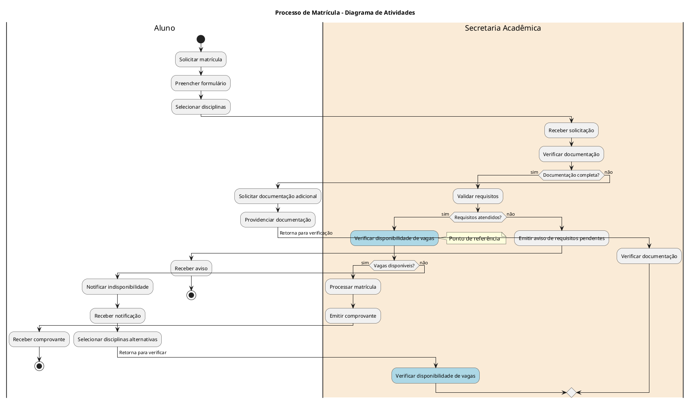
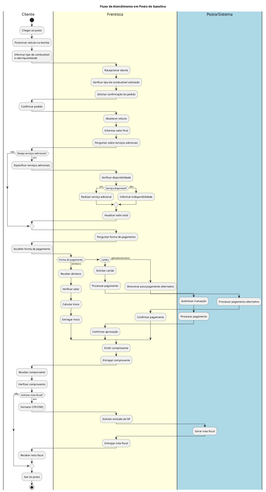
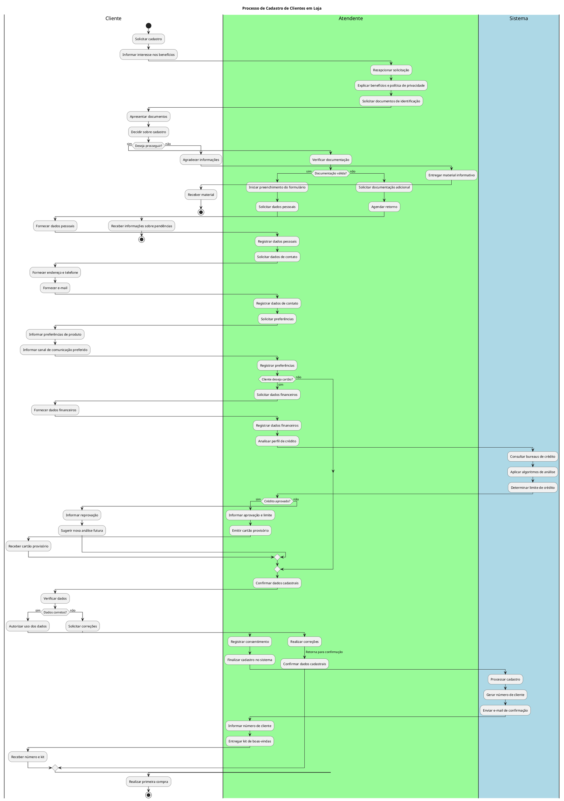

# Diagrama de Atividades na UML

O Diagrama de Atividades é um dos diagramas mais detalhistas da UML (Unified Modeling Language), baseado em redes de Petri com ênfase no nível algorítmico. Possui grande semelhança com fluxogramas de lógica e programação, sendo frequentemente representado com pseudocódigos ou mesmo linguagem de programação.

## Caracterização e Aplicações

Diferentemente do Diagrama de Sequência que representa um processo completo, o Diagrama de Atividades concentra-se na representação do fluxo de controle de uma atividade específica, descrevendo os passos necessários para a conclusão de um método ou algoritmo específico.

> O diagrama de atividades preocupa-se em descrever os passos a serem percorridos para a conclusão de um método ou algoritmo específico, não de um processo completo.

### Principais Aplicações

- Descrever atividades e fluxos de dados ou decisões entre atividades
- Fornecer uma visualização ampla dos processos comerciais
- Detalhar as atividades que ocorrem em um caso de uso
- Mostrar diversas atividades usando símbolos específicos
- Representar segmentos de execução paralela

## Componentes Fundamentais

### Estado de Ação

Representa a realização de uma ação dentro de um fluxo de controle. Possui características específicas:

- É atômico (não pode ser decomposto em sub-estados)
- Não possui ações internas
- Sua execução é considerada rápida e não pode ser interrompida
- Representado graficamente por um retângulo com bordas arredondadas

### Ponto de Decisão

Representa um ponto do fluxo onde ocorre um teste ou tomada de decisão, determinando qual caminho o fluxo seguirá:

- Representado por um losango
- As transições que saem do ponto de decisão necessitam de condições de guarda (textos entre colchetes)
- De um ponto de decisão partem pelo menos duas transições

### Estado de Sub-Atividade

Representa a execução de uma sequência não atômica de etapas com alguma duração:

- Comparável a uma sub-rotina que será ou foi explorada em outro diagrama
- Evita a duplicação de diagramas já representados

### Concorrência Dinâmica

Informa a ocorrência de um laço onde um mesmo estado de ação pode se repetir diversas vezes:

- Identificada pelo símbolo de multiplicidade (*) ao fim da descrição do estado de ação
- Evita a repetição do mesmo estado múltiplas vezes no diagrama

### Fluxo de Objetos

Representa o estado dos objetos envolvidos na atividade:

- Representado por uma linha tracejada com seta (semelhante ao símbolo de dependência)
- Aponta para um retângulo com o nome do objeto e a classe à qual pertence

### Envio e Recebimento de Sinal

Representa a transmissão e o recebimento de um sinal de um dispositivo externo:

- Normalmente utilizado para representar interações com hardware
- Identifica pontos de comunicação externa

## Raias de Natação (Swimlanes)

As raias de natação são uma extensão importante do diagrama de atividades:

- Identificam os diversos setores, departamentos ou atores que interagem com um processo
- Representadas por retângulos com divisões por zonas de influência
- Facilitam a compreensão da responsabilidade de cada entidade no processo
- Permitem visualizar claramente as interações entre diferentes departamentos ou atores

## Notas de Implementação

Para a criação de diagramas de atividades com a ferramenta Astah, deve-se seguir alguns passos fundamentais:

1. Criar um novo arquivo e uma pasta específica para o diagrama
2. Criar as raias verticais para representar cada ator ou setor envolvido
3. Definir o estado inicial com seu respectivo símbolo
4. Criar os estados de ação necessários, conectando-os com setas de transição
5. Adicionar pontos de decisão e suas respectivas condições de guarda
6. Incluir estados finais para representar o término do fluxo
7. Revisar o diagrama para garantir a correta representação do processo

### Exemplo

Matrícula de aluno

- Nota: a foto do exemplo acima foi criada por PlantUML de acordo com este código:

## Exercícios Sugeridos

Para praticar a criação de diagramas de atividades, são propostos dois exercícios:

1. Modelar o fluxo de atendimento em um posto de gasolina, considerando as interações entre Cliente, Frentista e Posto
2. Representar o processo de cadastro de clientes em uma loja

Respostas:

----------

O Diagrama de Atividades constitui uma ferramenta essencial para a representação detalhada de processos e algoritmos, permitindo uma visão clara e estruturada do fluxo de atividades em um sistema ou método específico.
