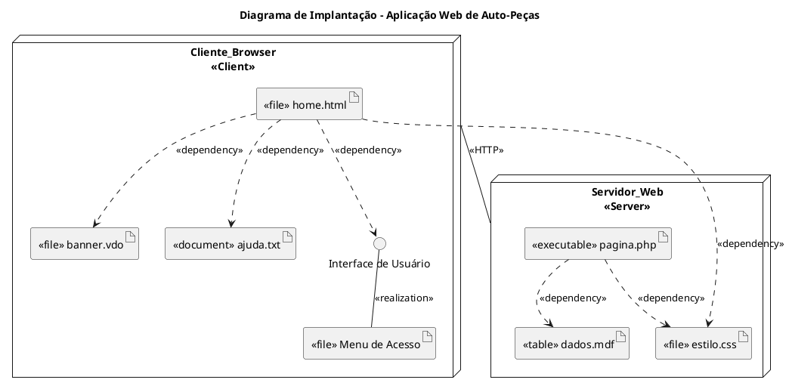
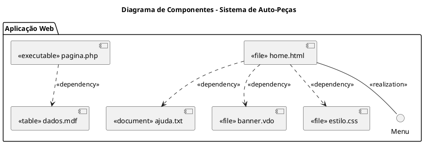

# Diagramas de Implementação na UML

Os Diagramas de Implementação são uma categoria da UML (Unified Modeling Language) que representam aspectos de implementação física dos sistemas, incluindo tanto a estrutura de componentes quanto a estrutura do sistema em tempo de execução. Estes diagramas são fundamentais para visualizar a organização dos artefatos físicos que compõem o software.

## Categorização dos Diagramas de Implementação

Na UML, os diagramas de implementação são expressos em duas formas principais:

1. **Diagrama de Componentes**: Foca nos elementos modulares do software
2. **Diagrama de Implantação**: Representa a disposição física dos componentes em hardware

## Diagrama de Componentes

### Definição e Propósito

O Diagrama de Componentes especifica um conjunto de construções utilizadas para definir sistemas de software, identificando componentes como unidades modulares com interfaces bem definidas e substituíveis dentro de seu ambiente.

> O objetivo do diagrama de componentes é mostrar "caixas pretas" que especificam suas interfaces, permitindo que outros componentes acessem seus serviços sem conhecer seu conteúdo interno.

Principais características:

- Apresenta uma visão estática da implementação do sistema
- Está fortemente associado à linguagem de programação escolhida
- Identifica os arquivos que comporão o software em termos de módulos, bibliotecas, formulários e outros elementos estruturais
- Determina os relacionamentos entre os diversos componentes

### Representação Gráfica de Componentes

Cada arquivo que compõe o sistema pode ser considerado um componente, sendo representado por um retângulo principal contendo o nome do módulo, com dois retângulos menores sobressaindo-se à sua esquerda.

### Estereótipos de Componentes

Os estereótipos são fundamentais para especificar o tipo de cada componente:

1. **Executável** (`<<executable>>`): Determina que o componente é um arquivo compilado, pronto para executar um conjunto de instruções

2. **Biblioteca** (`<<library>>`): Refere-se a bibliotecas contendo funções e sub-rotinas compartilháveis entre diversos componentes executáveis, podendo ser fornecidas pela linguagem ou por desenvolvedores

3. **Tabela** (`<<table>>`): Identifica repositórios físicos de dados onde os registros produzidos pelo sistema serão armazenados

4. **Documento** (`<<document>>`): Referencia arquivos de texto utilizados pelo sistema, como arquivos de ajuda (help)

5. **Arquivo** (`<<file>>`): Designa qualquer outro arquivo que componha o sistema, como código-fonte dos módulos

### Relacionamentos entre Componentes

#### Dependência

Um componente pode utilizar serviços ou depender de outros componentes do sistema. Esta relação é representada através do relacionamento de dependência, indicado por uma seta pontilhada apontando do componente dependente para o componente do qual depende.

## Diagrama de Implantação

### Definição e Propósito

O Diagrama de Implantação representa a visão mais física da UML, enfocando a organização e a estrutura física na qual o software será implantado.

Características principais:

- Mostra a disposição dos equipamentos conectados através de protocolos de comunicação
- Torna-se necessário apenas quando o sistema modelado será executado em múltiplas máquinas
- Não é requisitado quando o projeto se destina a apenas um equipamento

### Elementos Fundamentais

#### Nós

Os nós são componentes básicos do diagrama de implantação, representando máquinas onde um ou mais módulos do sistema serão executados. São representados graficamente por um cubo contendo o nome do elemento que representa.

#### Associações

As associações representam ligações físicas que possibilitam a troca de informações entre nós. São indicadas por retas conectando um nó a outro, frequentemente acompanhadas de estereótipos que especificam o tipo de conexão (como `<<HTTP>>`, `<<TCP/IP>>`, entre outros).

### Combinação com Diagramas de Componentes

Os diagramas de implantação e de componentes podem ser combinados, permitindo a modelagem integrada dos aspectos físicos e lógicos do sistema. É comum identificar os componentes que são executados por cada nó, criando uma visão completa da arquitetura física do sistema.

## Implementação Prática com Astah

Para criar diagramas de implementação utilizando a ferramenta Astah, recomenda-se seguir uma abordagem metódica:

1. Criar uma pasta específica para o diagrama no projeto
2. Adicionar o diagrama de componentes ou implantação conforme necessário
3. Para diagramas de componentes:
   - Desenhar os componentes com seus estereótipos adequados
   - Estabelecer as dependências entre componentes
   - Representar interfaces quando aplicável
4. Para diagramas de implantação:
   - Criar os nós que representam as máquinas físicas
   - Estabelecer as associações entre nós, adicionando estereótipos de protocolos
   - Quando apropriado, adicionar componentes dentro dos nós

## Aplicações Práticas

Os diagramas de implementação são particularmente úteis em cenários como:

- Sistemas distribuídos com múltiplos servidores e clientes
- Aplicações com arquitetura cliente-servidor
- Sistemas que utilizam diferentes tecnologias e plataformas
- Software que requer implantação em ambientes complexos de hardware

## Considerações Finais

Os diagramas de implementação fornecem uma visão essencial dos aspectos físicos da arquitetura de software, complementando outros diagramas da UML que focam em aspectos comportamentais ou estruturais em nível conceitual. Eles constituem uma ponte importante entre o design lógico do sistema e sua implementação física.

----------

## Exercício

----------



