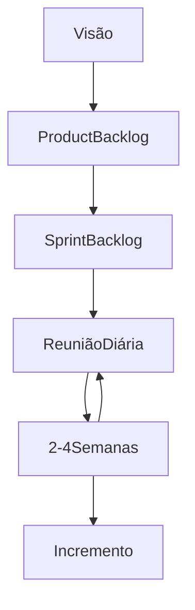

## Método tradicional

Antigamente existiam, dentro das atividades do processo de desenvolvimento de um software, um método linear de execução entre elas.

Assim, a execução da comunicação norteava e indicava os requisitos, e que, após uma aprovação do cliente, o planejamento ficava responsável pelo design da aplicação para ser aprovada. Somente após essa aprovação, começava a atividade de modelagem para, verdadeiramente, programar a aplicação. Antes de entrar na parte de testes, mais uma aprovação era necessária e, então - a Construção final lidava com os testes e seguia para a aprovação da implementação, isto é, a entrega.

Tudo isso demorava um tempo considerável, pois precisavam torcer o cliente até a última "gota" para ter um balde cheio de requisitos, e sempre devia passar por uma aprovação para seguir na próxima etapa/atividade.

### Agilidade

Analisando a breve leitura dos parágrafos anteriores percebemos que faltava uma agilidade, e até mesmo uma certa confiabilidade do cliente para com a empresa de software pois, tudo precisava passar por uma aprovação e, o que o cliente pensa hoje já é diferente do que ele pensava ontem, e do que pensará amanhã.

Como as etapas demoravam, essa volatilidade do pensamento do cliente era um abismo entre os primeiros requisitos com o que eles estão esperando no momento das entregas. Assim, a agilidade se fez mais do que necessária para responder às constantes mudanças de requisitos do software, das tecnologias, das pessoas e demais necessidades, pois é com a Agilidade que estas respostas se tornam possíveis.

## Métodos Ágeis

Assim, em torno dos anos 2000, surgem as metodologias ágeis, que se mantém firmes e fortes até hoje. Elas são uma evolução da Engenharia de Software tradicional para atender algumas exigências, além da [[#Agilidade]], como vimos acima, como:

- **Flexibilidade**
  - É difícil prever logo no início todos os requisitos.
- **Maior Produtividade**
  - Pois reduz a carga de pressão tendo reviews semanais do projeto, para indicar o caminho a ser seguido.
- Dentre outras praticidades

Em 2001, americanos e europeus se reuniram e criaram o [**Manifesto Ágil**](https://agilemanifesto.org/), que unia as opiniões e técnicas adotadas por diversas empresas, em pontos comuns. O Manifesto traz alguns princípios e valores relacionados com agilidade, e vemos quais as diferenças adotadas por cada empresa, determinando os diversos tipos de Metodologias Ágeis.

### Valores Ágeis

#### Características principais

- Entrega incremental do software
  - Por entregarmos uma parte do software a cada 2~3 semanas, não entregamos o software completo de uma vez, mas um incremento, como uma peça de um quebra cabeça, que sozinha não faz muito sentido, mas que, ao unir com outras partes, ou outros incrementos, feitos constantemente, resultará numa bela imagem final (software).
- Equipes pequenas, comprometidas e motivadas
  - Quanto mais pessoas temos numa equipe, mais problemas de comunicação podem acontecer. Como as pessoas que formam a equipe precisam sempre estar com o pensamento alinhado e motivadas, cerca de 5-10 e não mais que isso é o suficiente para o modelo ágil.
- Simplicidade e menos formalismo
  - Estando sempre em contato com o cliente e com a equipe, o "menos é mais" nessa hora. Pois quanto mais simples for o incremento, mais fácil de escalonar e de explicar ao cliente.
- Comunicação e colaboração (ver segundo item)
- Satisfação do cliente
  - Sempre a qualidade na entrega, isto é, a satisfação do cliente deve ser o motor principal de cada equipe num modelo ágil de desenvolvimento.

Por serem aplicáveis a todo e qualquer projeto, as atividades genéricas estão presentes mas são praticadas de maneira simplificada.

## O Scrum

É um modelo para desenvolvimento de produtos para gerenciamento baseado em ciclo de vida iterativo-incremental. Seu foco é na entrega antecipada e frequente das funcionalidades que agregam valor para o cliente (é com base na comunicação com o cliente que definirá o foco das funcionalidades).

Scrum recomenda um fluxo de trabalho bem enxuto para a realização do desenvolvimento com base em algumas atribuições ou papéis (funções pessoais), os artefatos ou produtos do Scrum e as reuniões necessárias.

- Atribuições/papéis: Product Owner, Scrum Master, Desenvolvedor/time;
- Artefatos: Product Backlog, Sprint Backlog.
- Cerimônias/Reuniões: Planejamento, Reunião Diária, Demonstração e Retrospectiva.

### Product Owner

Responsável pelo retorno do investimento, sendo o representante do cliente para o projeto. É desejável que seja alguém do lado do cliente, pois é ele quem definirá a visão do produto desejado a ser desenvolvido. Como nem sempre existe alguém do lado do cliente para exercer esse papel, alguém da parte da empresa desenvolvedora define alguém para fazer este "meio de campo", que, quando definido, a pessoa assume o papel do cliente.

Ele apresentará os requisitos do produto para o time, priorizando os requisitos com base no valor para o cliente, planejando as entregas e os incrementos a serem "despachados" primeiro. Por estar durante a semana de trabalho, ele participa dos debates para alinhar as expectativas do cliente e do time.

Existe uma certificação para P.O.

### Scrum Master

O Scrum Master facilita o dia-a-dia do time, sendo este o principal papel, sendo um facilitador, retirando os impedimentos.. enfim, tornando a vida mais fácil. Ele é quem protege o time das interrupções e interferências externas, pois as pessoas falam com ele antes de falar com o time, para que o desenvolvimento não seja interrompido.

Além disso, promove a comunicação e garante que o time se mantenha produtivo, ajudando o time a se comportar de uma maneira "ágil" e sabendo o seu papel. É ele quem marca as cerimônias/reuniões, garantindo que as mesmas aconteçam.

Existe uma certificação para Scrum Master.

### Time

Indo de 5 a 7 participantes que precisam deter um comprometimento de realizar os trabalhos, dentro do limite do projeto, para alcançar as metas propostas e acordadas. Estão sempre próximos fisicamente, ao menos até a pandemia. Isso era proposto para não precisar esperar uma reunião para se comunicar com o outro.

Por não ter um Gerente específico, ou um papel de gestão, a auto organização e comprometimento de cada um é necessário. Assim, o próprio time define as tarefas e quem realizará cada tarefa. No entanto, embora não exista um gerente no projeto, existe o gerente da empresa em si, que pode despedir quem estiver "empenando" o projeto.

Enquanto time, todos são time. Por isso, trabalhar com SCRUM, exige uma multidisciplinaridade, isto é, estar atento aos trabalhos existentes para, após a execução daquilo que você tem mais facilidade/conforto, mas estará sempre habilitado o realizar demais trabalhos.



### Visão

O Dono da visão, ou melhor, quem expressa a visão, é o P.O. Ele indicará uma frase ou parágrafo que representa a necessidade a ser satisfeita ao final do projeto. Uma das técnicas a ser escrita esta frase ou parágrafo, é a Frase de Elevador (Elevator Statement).

#### Elevator Statement

Modelo:

```md
**Para** <cliente/público>
**que** <necessidade do cliente/público ou oportunidade> o <nome do produto> **é um** <categoria/tipo de produto> **que** <principal benefício ou razão de comprar o produto>. **Diferente do** <principal competidor/alternativa> **nosso produto** <principal diferencial>
```

![[Atividade em sala - frase de elevador com visão de produto da área ambiental.]]

### Product Backlog

Após a visão do produto, nós descrevemos o que o produto deve ter. O Product Backlog é a lista de requisitos que serão atendidos no projeto. Quem elenca os itens do Product Backlog é o P.O., bem como irá priorizar alguns itens de maior valor para o cliente.

O Product Backlog é mutável, isto é, pode ser alterado _on demand_ para o acréscimo de novos itens, a alteração dos mesmos, bem como a prioridade ser alterada. É uma lista viva, pois novos itens chegam, com novas informações, bem como itens prioritários podem deixar para ser implementado no fim do projeto, ou até mesmo ser removido.

Cada sprint implementa os requisitos de prioridade mais alta, por isso eles precisam ser bem descritivos. Requisitos podem ser repriorizados pelo P.O. a qualquer momento enquanto novos podem ser inseridos e outros podem ser removidos. Quanto maior a prioridade, mais descrição o requisito terá.

Cada item é chamado de User Story (História de Usuário).

Todas as funcionalidades tem de estar descritas como UserStory no project backlog. Normalmente, no início do projeto, é uma lista grande. Conforme o produto é desenvolvido pode ir aumentando ou diminuindo conforme a necessidade do cliente.

Os User Storys, conforme maior prioridade ou proximidade de serem implementados, sempre devem estar mais detalhados do que os demais; estes outros, conforme vão se aproximando de serem implementados, e por consequência, serem repriorizados, deverão ter sua descrição incrementada com mais detalhes.

É possível que cada UserStory contenha uma estimativa dada pela equipe do projeto, a partir das cerimônias onde o time questiona o P.O. sobre todas as funcionalidades de cada UserStory, e assim determinam uma grandeza/complexidade e estimar um valor em Pontos por história. Mas que possam ser por dias, ou por horas - mas não tendo uma régua em si, senão o próprio time que "dita" a régua a qual a estimativa será feita.

#### UserStory

Descrição do desejo do usuário, com um Título, detalhamento e critérios de aceitação, sempre respondendo três perguntas: **quem, o que e por que?**.

Um exemplo é -> _"Como um \<papel\>, quero \<necessidade\>, para \<finalidade\>"_ _(As role, I want feature, so that value.)_

> [!quote] Exemplos
> Como **cliente do banco**, quero **executar uma transferência**, para **repassar um valor de minha conta para um colega**
> Como **usuário**, posso **exportar dados em XML** para **integrar minhas informações com outros sistemas**

> [!important] Importância Única
> É muito interessante darmos um número de importância única e não sequencial. Criando o primeiro item de maior importância num número x, o próximo item seja realizado em x-y, e não x-1. Pois, se algo surge de maior importância, de maior prioridade do segundo item, você terá que mexer na lista toda.
> Ex: Implementar a transferência -> importância 100; Implementar o extrato da conta -> importância 95.
> > Surgindo uma tarefa de importância maior, posso colocar 96-99 tranquilamente, deixando o extrato em 95.

### Sprint Backlog

São um conjunto de histórias eleitas para serem tratadas na Sprint (usualmente as que estão no topo do Product Backlog).

Elas devem conter detalhes suficientes para a implementação contendo os itens abaixo, mas não somente:

- Detalhamento Funcional
- Critérios de aceitação
- Premissas e restrições

### Fluxo do Scrum (Sprint)

Uma sprint é um intervalo de tempo bem curto, normalmente 10 dias úteis a 20 dias úteis. Mas não é um número fechado, podem ser 12 dias úteis, 8 dias úteis.. enfim. Dentro desse tempo temos uma série de cerimônias que acontecem dentro deste sprint.

#### Planejamento

Começamos, sempre no primeiro dia da Sprint, com a reunião de **Planejamento**. Normalmente o planejamento ocupa metade do primeiro dia de trabalho (4h/trabalho), e a depender das variáveis (tamanho da equipe e duração da sprint), pode durar mais, chegando a ocupar o dia inteiro, ou menos.

É uma cerimônia obrigatória e muito importante. Nela participam o Scrum Master, o Time Completo e o Product Owner participa, ao menos, da primeira parte da reunião. Esta **primeira parte** é onde o P.O. trará todas as "dores" e histórias do cliente, a partir das prospecções que ele fez e explicar ao time da maneira mais detalhada possível. A **Segunda parte** é um detalhamento técnico feito pelo time de todas as tarefas, quebrando as funcionalidades num conjunto de tarefas a serem implementadas e trabalhadas. O _Scrum Master_ durante as duas partes atua como um documentador, para elencar as tarefas e repassar, no momento oportuno, todas as funcionalidades exibidas pelo P.O., com cada tarefa detalhada pelo Time.

Ao fim, chama-se o Product Owner para expor as estimativas sejam positivas (isto é, que cabe mais uma história a ser trabalhada), se são neutras (que as histórias que foram expostas estarão justamente prontas no tempo da sprint), ou negativas (se as funcionalidades estão aquém do tempo esperado pela sprint).

> [!hot] Um detalhe
> Após o planejamento, uma funcionalidade é aberta e somente é aberta outra funcionalidade no momento em que todas as tarefas da primeira estejam completadas no gestor de tarefas/tempo/projeto. **Foco: Uma funcionalidade só é aberta, isto é, só se começa a trabalhar numa nova funcionalidade a partir do fechamento da anterior, ou, de quando a funcionalidade anterior estiver pronta**

#### Daily Meeting (Reunião Diária)

É uma reunião do time para o time. Não é técnica, não é para retirar dúvidas, é uma reunião de _log_ que sempre respondem três perguntas: **O que fiz desde a última reunião; o que farei no dia de hoje; quais são os meus impedimentos**.

15 minutos são suficiente, não devendo demorar mais tempo -> Isto garante que todos consigam, em breves palavras, manter a equipe atualizada sobre o status de cada tarefa. É até recomendado que se faça em pé, para não sentar e não criar um "ar de comodismo". É algo simples, a primeira coisa do dia, só para atualizar e voltar à produção.

> [!faq] O que são os impedimentos?
> São toda e qualquer dificuldade que o time pode ter, como por exemplo falta de impressora; dificuldade do acesso à internet; computadores lentos; falta de empenho de um colega; não possuir acesso à uma ferramenta ou a um usuário...

#### Demonstração

A Demonstração normalmente dura somente 2h, mas para a demonstração dar certo é necessário preparo, e por isso é separado metade do dia de trabalho (4h). É demonstrado para o P.O e/ou para o cliente. É tratado normalmente como um evento, pois é realizado na finalização da Sprint.

O P.O. pode se mostrar totalmente satisfeito, o que é raro; parcialmente satisfeito, onde ele irá apontar algumas pendências, ou insatisfeito, que acontece em dois casos: a) a equipe não conseguiu implementar ou; b) o resultado não cumpriu as expectativas.

#### Retrospectiva

No mesmo dia em que é realizada a demonstração, é feita a reunião de retrospectiva onde é debatido todo o projeto e execução do mesmo, elencando os pontos positivos e negativos onde o Scrum Master irá, junto da equipe, escolher alguns pontos de melhora dentro dos negativos. É uma melhoria contínua dentro do próprio projeto, pois a cada 10~15 dias há uma nova reunião de retrospectiva, afim de sempre estar melhorando.

Algumas perguntas de início, podem ser: o que foi bom, o que não foi bom, o que podemos melhorar? Conforme o tempo passa, estas perguntas se tornam clichês e o Scrum Master pode trabalhar de modo diferente do que somente as perguntas -> num exemplo que a professora trouxe foi o de imagens diversas espalhadas numa mesa, e cada um pega uma  imagem para explicar, com a imagem, o que acharam do sprint.

---
> Feito todas estas cerimônias finais de sprint, passa-se o fim de semana e retornamos ao planejamento na segunda-feira para um novo sprint.

---

> [!faq] O que, de fato,  é um sprint?  
> É um esforço concentrado com duração fixa (determinada no início do projeto e mantida até o fim do mesmo).

----

##### Trabalho em Sala

**Engenharia de Software I**

**Atividade: aplicação de práticas do SCRUM**

**Objetivo principal**

Praticar os conhecimentos obtidos sobre Métodos Ágeis e especificamente sobre SCRUM.

**Outros objetivos**

- Praticar a decomposição de um problema em pacotes de trabalho.  
- Elaboração de Backlog de Produto.
- Priorização dos itens do backlog.
- Desenvolvimento de habilidades de comunicação, trabalho em equipe, colaboração e comprometimento.

**Cenário**

Nosso cliente é um banco que está nos contratando para o desenvolvimento de um aplicativo para transações bancárias. A ideia é que os clientes do banco possam realizar as transações bancárias no celular, sem a necessidade de ir até uma agência.

**Entrega**

- **Backlog do produto**: cada item será uma funcionalidade e deve conter: id, título, descrição e prioridade.  
- **Prioridade**: o item mais importante do backlog deve receber prioridade 100 e os demais itens devem receber um número único, menor que 100, que represente a importância do item para o projeto.  

Anexo: formato sugerido para o trabalho.

**Instruções**

- O trabalho será desenvolvido em dupla
- Todos os alunos devem entregar o resultado da tarefa no MSTeams  

%%**Material de Apoio**

- Slides das aulas na equipe do MSTeams, em canal Geral/ Arquivos/ Material de Aula.  
- [artigo] Escrevendo colaborativamente a Visão do Produto, em [https://caroli.org/atividade-escrevendo-colaborativamente-a-visao-do-produto/](https://caroli.org/atividade-escrevendo-colaborativamente-a-visao-do-produto/)
- [artigo] Histórias de usuário e a construção de produtos de sucesso, em [https://caroli.org/historias-do-usuario-e-a-construcao-de-produtos-de-sucesso/](https://caroli.org/historias-do-usuario-e-a-construcao-de-produtos-de-sucesso/)
- [livro] Engenharia de Software Moderna, item 3.3 – Histórias de Usuário, em [https://engsoftmoderna.info/cap3.html#hist%C3%B3rias-de-usu%C3%A1rios](https://engsoftmoderna.info/cap3.html#hist%C3%B3rias-de-usu%C3%A1rios)%%

Trabalho meu e do Mateus:

| Nome do Aplicativo                                                                                                                                                                                                                                                                                                                                                                                                                                                                                                                                                                                                                                                                                                                 |                |                                               |                                                                                                                                                                                                                                    |     |
| ---------------------------------------------------------------------------------------------------------------------------------------------------------------------------------------------------------------------------------------------------------------------------------------------------------------------------------------------------------------------------------------------------------------------------------------------------------------------------------------------------------------------------------------------------------------------------------------------------------------------------------------------------------------------------------------------------------------------------------- | -------------- | --------------------------------------------- | ---------------------------------------------------------------------------------------------------------------------------------------------------------------------------------------------------------------------------------- | --- |
| Denário Bank                                                                                                                                                                                                                                                                                                                                                                                                                                                                                                                                                                                                                                                                                                                       |                |                                               |                                                                                                                                                                                                                                    |     |
| Visão do Produto                                                                                                                                                                                                                                                                                                                                                                                                                                                                                                                                                                                                                                                                                                                   |                |                                               |                                                                                                                                                                                                                                    |     |
| _Para os clientes do banco “Denário Bank” que tem um interesse em realizar transações bancárias de todos os tipos no conforto de onde estiverem, a partir de um aparelho móvel, o App “Denário Bank” é um aplicativo para smartphones de última geração, que oferece todas as funcionalidades de um caixa eletrônico na palma de sua mão, além de vários benefícios que somente são acessíveis através do gerente. Diferentemente dos demais aplicativos bancários tradicionais, nosso App “Denário Bank” possui uma inteligência artificial generativa, que analisará mensalmente novas cartelas de crédito, além de programas de benefícios e acessos a serviços sociais e demais itens de praticidade para os nossos clientes._ |                |                                               |                                                                                                                                                                                                                                    |     |
| Backlog                                                                                                                                                                                                                                                                                                                                                                                                                                                                                                                                                                                                                                                                                                                            |                |                                               |                                                                                                                                                                                                                                    |     |
| **id**                                                                                                                                                                                                                                                                                                                                                                                                                                                                                                                                                                                                                                                                                                                             | **Prioridade** | **(Cartão) Título**                           | **(Conversa) Descrição**                                                                                                                                                                                                           |     |
| 1                                                                                                                                                                                                                                                                                                                                                                                                                                                                                                                                                                                                                                                                                                                                  | **100**        | **Acesso à conta bancária**                   | _Como cliente do banco, quero ter acesso à minha conta, para realizar as movimentações no momento oportuno._                                                                                                                       |     |
| 2                                                                                                                                                                                                                                                                                                                                                                                                                                                                                                                                                                                                                                                                                                                                  | **95**         | **Possuir segurança nas transações**          | _Como cliente do banco, quero ter a plena certeza de que minha conta só será acessada por mim, via biometria digital ou senha pessoal e intransferível, para garantir a segurança dos meus acessos._                               |     |
| 3                                                                                                                                                                                                                                                                                                                                                                                                                                                                                                                                                                                                                                                                                                                                  | **81**         | **Realizar Pagamentos**                       | _Como cliente do banco, quero quitar minhas dívidas e boletos no conforto de minha casa ou qualquer outro ambiente que esteja, para aproveitar o tempo sem ter que me locomover até uma agência_                                   |     |
| 4                                                                                                                                                                                                                                                                                                                                                                                                                                                                                                                                                                                                                                                                                                                                  | **80**         | **Realizar transferência**                    | _Como cliente do banco, quero transferir um valor da minha conta para outra, para pagar uma dívida._                                                                                                                               |     |
| 5                                                                                                                                                                                                                                                                                                                                                                                                                                                                                                                                                                                                                                                                                                                                  | **70**         | **Verificar Extrato**                         | _Como cliente do banco, quero ter acesso ao extrato bancário dos últimos 30 dias ou mais, a depender do meu desejo, para ficar em dia com minhas obrigações e direitos._                                                           |     |
| 6                                                                                                                                                                                                                                                                                                                                                                                                                                                                                                                                                                                                                                                                                                                                  | **65**         | **Atualização Cadastral**                     | _Como cliente do banco, quero ter a possibilidade de alterar e atualizar meus dados pessoais, para que eu possa ter praticidade em atualizações de endereço, nome (em caso de casamento) e afins._                                 |     |
| 7                                                                                                                                                                                                                                                                                                                                                                                                                                                                                                                                                                                                                                                                                                                                  | **60**         | **Consultar saldo**                           | _Como cliente do banco, quero consultar o saldo da minha conta, para acompanhar minha situação financeira._                                                                                                                        |     |
| 8                                                                                                                                                                                                                                                                                                                                                                                                                                                                                                                                                                                                                                                                                                                                  | **45**         | **Câmbio**                                    | _Como cliente do banco, quero saber quanto meu dinheiro vale em outras moedas para planejar com antecedência uma viagem ao exterior._                                                                                              |     |
| 9                                                                                                                                                                                                                                                                                                                                                                                                                                                                                                                                                                                                                                                                                                                                  | **40**         | **Realizar Aplicações Financeiras**           | _Como cliente do banco, quero aproveitar do dinheiro em conta para aplicar em ações ou dividendos, através de investimentos seguros._                                                                                              |     |
| 10                                                                                                                                                                                                                                                                                                                                                                                                                                                                                                                                                                                                                                                                                                                                 | **35**         | **Portabilidade de Salário**                  | _Como cliente do banco, quero ter a praticidade de trazer meu salário dos grandes bancos, para aproveitar as melhores funcionalidades e benefícios deste banco._                                                                   |     |
| 11                                                                                                                                                                                                                                                                                                                                                                                                                                                                                                                                                                                                                                                                                                                                 | **32**         | **Cartela de Crédito atualizada mensalmente** | _Como cliente do banco, quero que a Inteligência Artificial do banco permita novas avaliações de crédito mensais, para que eu possa investir em bens materiais de meu interesse._                                                  |     |
| 12                                                                                                                                                                                                                                                                                                                                                                                                                                                                                                                                                                                                                                                                                                                                 | **20**         | **Visualização de serviços sociais**          | _Como cliente do banco, quero ter acesso às informações sociais, tais como INSS, FGTS, Minha Casa Minha Vida, e outros benefícios governamentais para ficar em dia com as pendências mensais e evitar burocracias desnecessárias._ |     |
| 13                                                                                                                                                                                                                                                                                                                                                                                                                                                                                                                                                                                                                                                                                                                                 | **10**         | **Programa “Indique e Ganhe”**                | _Como cliente do banco, quero ter a possibilidade de receber um benefício ao indicar este banco, para que meus entes queridos, familiares e amigos, possam desfrutar tanto quanto eu deste aplicativo e instituição._              |     |
